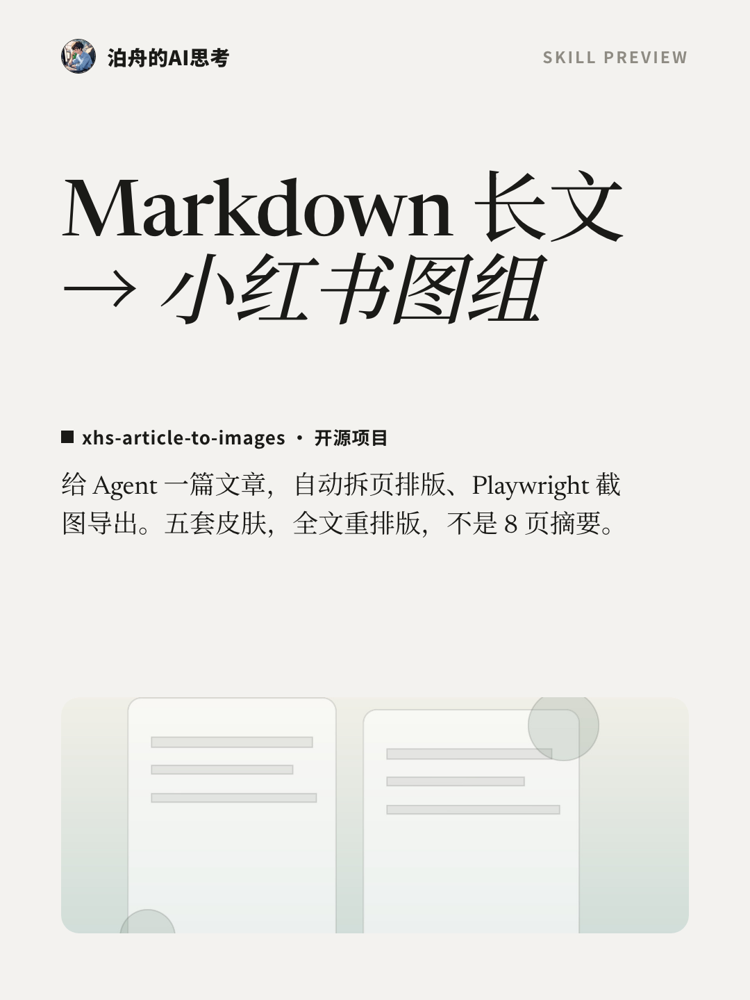
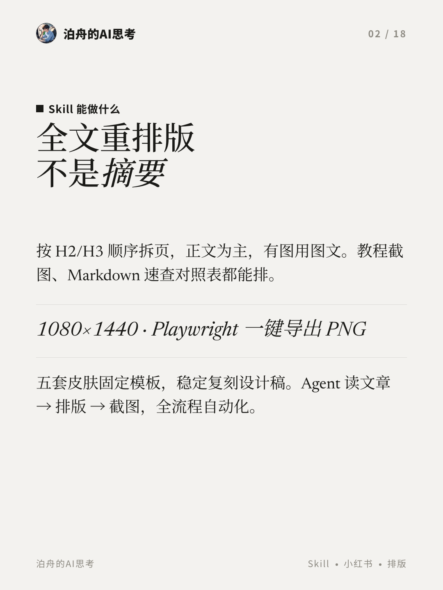
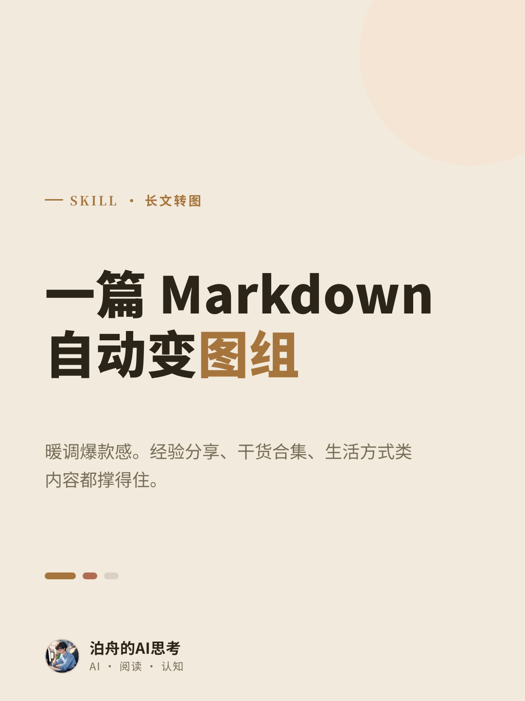
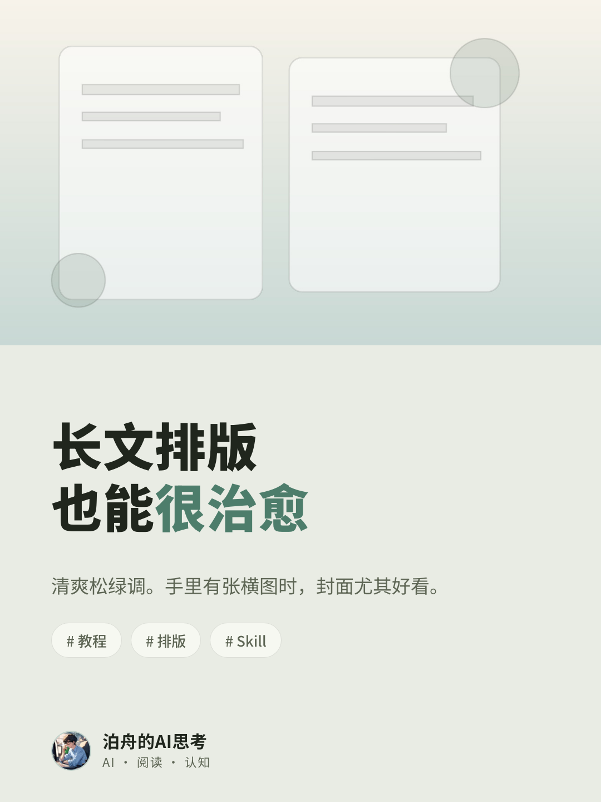
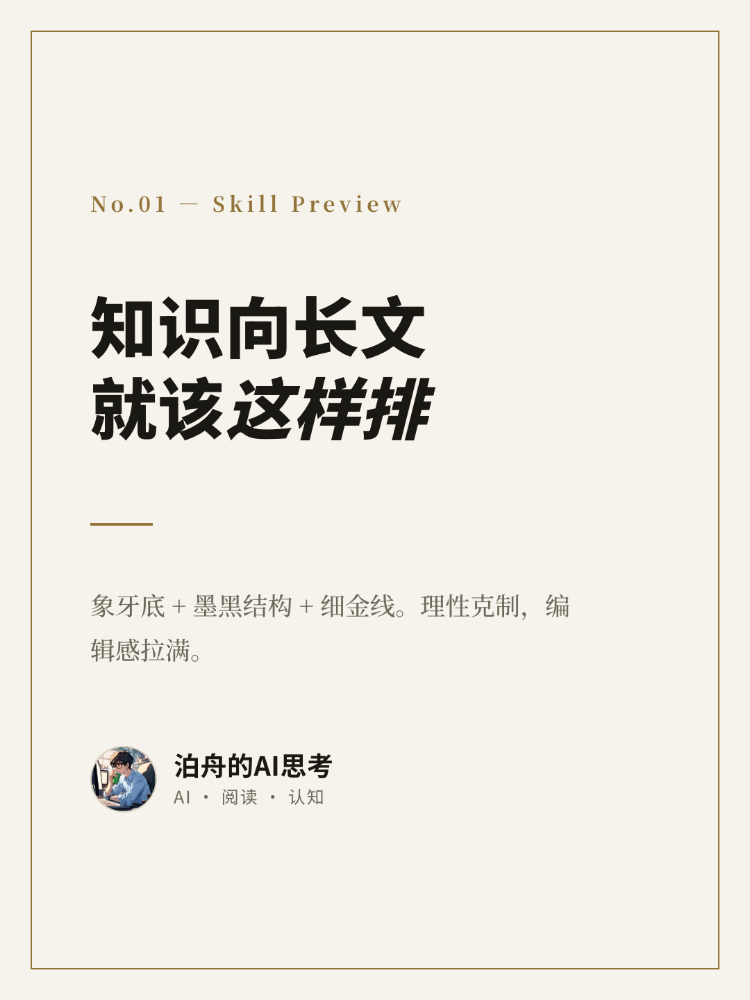
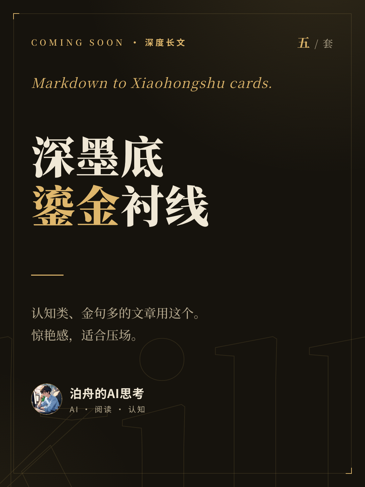
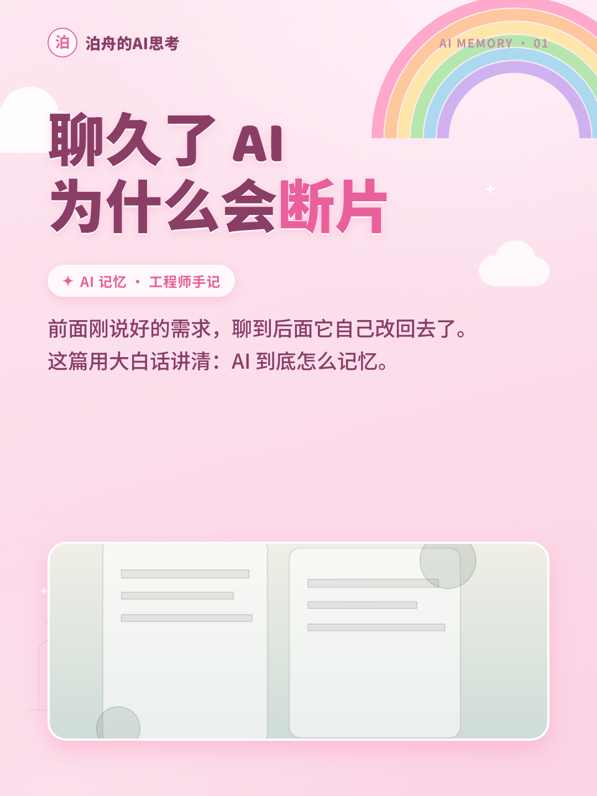
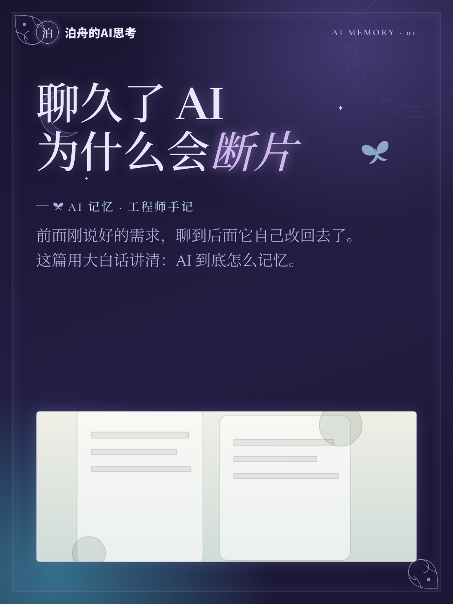
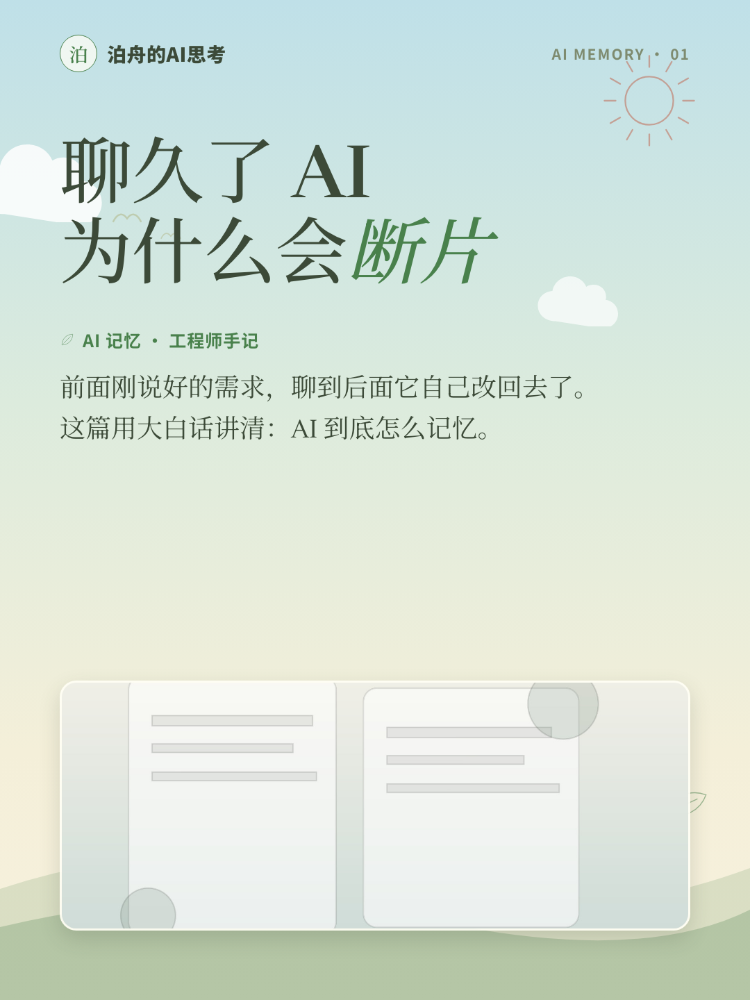

# xhs-article-to-images

把 Markdown 长文转成小红书 3:4 图片组的 Agent skill。

它不是传统的全自动 Markdown parser。推荐用法是：让 Codex / Claude 这类 Agent 读文章、按规则拆页、填入 HTML 模板，再用内置 Playwright 渲染器逐张导出 PNG。

## 效果预览

<table>
  <tr>
    <td></td>
    <td></td>
    <td></td>
  </tr>
  <tr>
    <td></td>
    <td></td>
    <td></td>
  </tr>
  <tr>
    <td></td>
    <td></td>
    <td></td>
  </tr>
</table>

## 能做什么

- 输出 1080 x 1440 PNG，适合小红书 3:4 图文。
- 内置五套设计皮肤：E 雅刊（默认）、A 暖杏奶咖、B 雾松青、C 黛墨描金、D 夜读鎏金。
- 外加女性向三主题：F 粉色王国（童话甜粉）、G 乙游夜境（暗黑浪漫）、H 吉卜力（治愈自然），共用一套 `femcard` 骨架、换类名即换主题。
- 支持封面、正文、图文混排、清单、金句、大字陈述、要点正文、三观对比、结尾等页型。
- 默认走全文重排版：正文为主，有图用图文，超容量拆页，不把长文硬压成 8 页摘要。
- 提供 `xhs-init` 初始化任务目录，`xhs-render` 渲染截图。

## 安装

```bash
git clone https://github.com/bozhouDev/xhs-article-to-images.git
cd xhs-article-to-images
npm install
npx playwright install chromium
```

作为 Codex / Claude skill 使用时，把仓库链接到你的 skills 目录：

```bash
ln -s "$(pwd)" ~/.codex/skills/xhs-article-to-images
# 或：
ln -s "$(pwd)" ~/.claude/skills/xhs-article-to-images
```

## 快速使用

初始化一篇文章的任务目录：

```bash
npm run init:task -- ./work/my-article
```

编辑 `./work/my-article/index.html`：保留需要的卡片，填入文章内容，把图片放进 `./work/my-article/assets/`。

渲染 PNG：

```bash
npm run render -- ./work/my-article
```

输出文件会在：

```text
./work/my-article/output/
```

需要 2 倍清晰度：

```bash
npm run render -- ./work/my-article --scale 2
```

## 预览图重渲

```bash
npm run render:preview
```

这会重新生成 `preview/output/*.png`，README 中的效果图也会随之更新。

## 目录结构

```text
.
├── SKILL.md                    # Agent 使用说明
├── assets/
│   ├── template.html            # 全量卡片模板
│   ├── styles.css               # A/B/C 皮肤
│   ├── styles-d.css             # D 夜读鎏金
│   ├── styles-e.css             # E 雅刊
│   ├── styles-fem.css           # 女性向三主题 F 粉色王国 / G 乙游夜境 / H 吉卜力
│   ├── avatar.png               # 示例头像，可替换
│   ├── cover-hero.jpg           # 示例封面图
│   ├── media-1.jpg              # 示例图文页图片
│   └── social/                  # 作者社媒二维码
├── references/
│   └── content-mapping.md       # 文章到卡片的拆页规则
├── scripts/
│   ├── init-task.cjs            # 初始化任务目录
│   └── render.cjs               # Playwright 截图导出
└── preview/                     # README 预览工程和输出图
```

## 品牌替换

默认模板里使用了“泊舟的AI思考”和示例头像。开源仓库保留它们作为可运行示例；正式使用时替换：

- `assets/avatar.png`
- HTML 里的品牌名、tagline 和页脚文案
- 封面/图文页中的示例图片

## 开源状态

这个仓库已经移除了本地绝对路径和私有 skill 依赖；`.DS_Store`、`node_modules`、普通任务输出目录会被忽略。`preview/output/*.png` 特意保留，用于 README 展示最终效果。

## 关注作者

如果这个项目对你有帮助，也可以关注一下我的社媒账号。

<table>
  <tr>
    <td align="center">
      
      <br>
      小红书
    </td>
    <td align="center">
      
      <br>
      抖音
    </td>
  </tr>
</table>

## License

MIT
