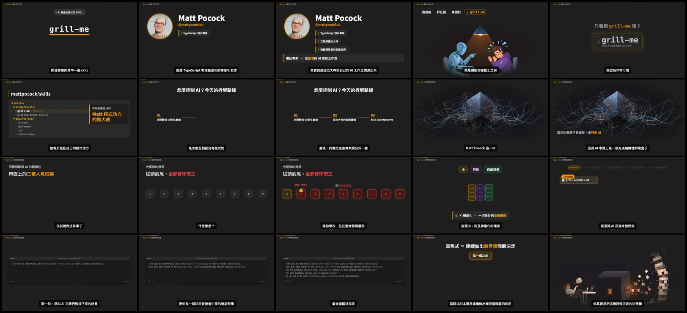

# Plan Geometric Explainer Video

Use the bundled Gary Chen corpus to turn narration into a restrained geometric scene system. Treat the source videos as evidence, not as loose inspiration.

## Enforce the evidence boundary

1. Read `references/source-ledger.md` and `references/reference-atlas.md` before making visual decisions.
2. Cite at least one rule ID and one evidence ID in every storyboard row.
3. Use a `recurring` rule as a channel convention only when the evidence index cites at least two different videos.
4. Use a `target-specific` rule only when reproducing the target video or when the user explicitly accepts that local pattern.
5. Label an implementation extrapolation as `inference`; state what is unobservable, such as the original easing curve, font file, or authoring software.
6. If no bundled evidence matches the intended meaning, request another reference or label the choice as a new direction. Do not silently add a visual grammar.

Run the evidence validator whenever the corpus or rules change:

```bash
python scripts/validate_evidence.py
```



## Load only the needed references

- Read `references/story-to-geometry.md` to map narration functions to observed diagram families.
- Read `references/visual-grammar.md` to select the current-series layout, typography, color roles, density, and subtitle treatment.
- Read `references/motion-grammar.md` to plan entry, emphasis, state change, and exit timing from paired source frames.
- Read `references/remotion-implementation.md` before writing Remotion code.
- Read `references/reference-atlas.md` when choosing images to show beside a storyboard or implementation plan.
- Query `references/evidence-index.json` when a rule needs machine-readable provenance.

## Follow the production workflow

### 1. Lock the content spine

Require a narration script, transcript, or chapter outline. Split it into meaning beats, not arbitrary time slices. Assign each beat one primary job:

- identify or define;
- enumerate;
- show sequence or causality;
- compare;
- show hierarchy or containment;
- show state change, failure, or recovery;
- demonstrate with real UI or source material;
- summarize or conclude.

Do not select shapes until the beat has one primary job.

### 2. Select an observed diagram family

Use `references/story-to-geometry.md`. Prefer one dominant structure per shot. Reuse the same geometry while changing state when the narration describes progression; cut to another structure when the conceptual model changes.

For each selection, record:

```text
scene_id | narration/time | semantic job | diagram family | rule_ids |
evidence_ids | reference image | certainty | adaptation notes
```


### 3. Build the storyboard in evidence order

For every scene, specify:

1. the neutral starting frame;
2. the first readable state;
3. each narration-triggered change;
4. the final held state;
5. the cut or transition out;
6. the exact reference frame or sequence used.

Do not write vague motion such as “make it dynamic.” Name the property that changes: opacity, position, scale, connector length, border color, fill color, progress width, or group arrangement.

### 4. Establish tokens from the selected evidence set

Use only values documented in `references/visual-grammar.md`. Keep measured or sampled values separate from visual approximations. Do not mix the earlier neon finance-era palette into the current flat AI-explainer system unless the user explicitly requests that earlier era.

### 5. Implement deterministically in Remotion

- Drive every animation from `useCurrentFrame()` and `useVideoConfig()`.
- Express authored time in seconds, then multiply by `fps`.
- Use `<Sequence>` or `<Series>` for scene timing and premount every sequence.
- Use `interpolate()` for controlled state changes and `spring()` only where a source-frame sequence supports a settling entrance.
- Do not use CSS animations or CSS transitions.
- Load local fonts before rendering and measure long text before placing it in fixed cards.
- Use `` with `staticFile()` for local images.
- Keep subtitles on their own track so they do not alter diagram layout.
- Add source comments beside evidence-mapped components, for example `// E014, 00:01:55.10–00:01:57.40`.

Use the verified component example under `assets/remotion-primitives/` as implementation evidence for the target segment, not as proof of an unobserved channel-wide rule.

### 6. Review with stills before rendering

Render at least three stills per scene: entry, midpoint, and final hold. Compare them with the cited reference image for:

- alignment and safe margins;
- information density;
- text hierarchy and line length;
- primitive count and grouping;
- color role rather than superficial color matching;
- whether the intended state change is visible without narration.

### 7. Verify the final video

Require all of the following before declaring completion:

- every scene has evidence IDs;
- `python scripts/validate_evidence.py` passes;
- no text, nodes, or captions overflow at representative stills;
- the Remotion render exits successfully;
- FFmpeg decodes the complete video with no errors;
- the final report distinguishes direct observation from implementation inference.

## Return this deliverable set

Produce:

1. a source-backed storyboard table;
2. a visual token sheet with evidence IDs;
3. a scene/component map for Remotion;
4. representative reference images beside each diagram family;
5. a list of target-specific and inferred choices;
6. the render and a still-based comparison sheet when implementation is requested.

Never deliver a text-only design plan when the request asks to match this visual system. Include the cited bundled images or user-provided reference frames in the handoff.

## Maintain the corpus

Use `scripts/extract_reference_frames.py` to add exact source frames from a timestamp manifest. Add the new source, evidence item, and affected rule to `references/evidence-index.json`, update the atlas, then rerun the validator. Preserve attribution and keep reference frames separate from production artwork.
