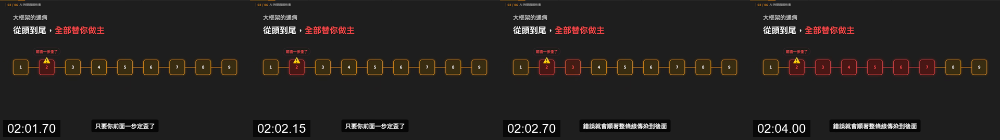
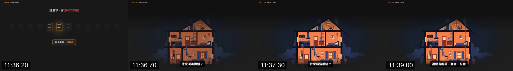

# Motion grammar

The target uses a fixed camera. Motion normally clarifies a relation or state rather than moving the whole frame for energy.

## Core sequencing syntax

R16 is the observed target sequence:

1. `Establish`: headline and inactive scaffold become readable.
2. `Focus`: orange marks the node, card, or path currently discussed.
3. `Mutate`: preserve geometry and change the relevant state.
4. `Explain`: append a guard, warning, result, row, or verdict.
5. `Exit`: replace or fade the SceneStage while fixed chrome/captions remain.

## Observed motion families

| Family | Properties that visibly change | Sequence evidence | Rule |
|---|---|---|---|
| title + underline | opacity; underline width/scaleX from left | E001 | R18 |
| process activation | border/fill/glow/connector state; positions stay fixed | E002 | R06, R07 |
| error propagation | node and connector palette changes downstream | E003 | R07, R10 |
| scatter to grid | x, y, rotation, scale/opacity settle to shared grid | E004 | R08 |
| progressive compare | scene children enter in claim/left/right/result order | E006 | R09 |
| guard insertion | relationship badge enters after both sides | E007 | R16 |
| dependency draw | connector visibility/path length changes behind fixed cards | E009 | R18 |
| secondary panel insertion | opacity and horizontal position; possible surface brightening | E011 | R12, R18 |
| mapping rows | children append downward without reflowing existing rows | E012, E019 | R16 |
| verdict overlay | comparison dim opacity; callout opacity/scale/vertical offset | E013 | R09, R16 |
| CTA replacement | old group exits; pill enters; child actions stagger | E014 | R18 |

## Target-specific timing calibration

Only the reconstructed V00 interval 01:49–02:16 has exact implementation values. Keep these under a segment-local namespace such as `calibrated109to136`, as required by R17:

- Scene root enter: 30 frames at 60 fps, opacity plus `translateY: 16→0`.
- Framework-card exit: 36 frames, opacity plus `translateY: 0→-20`.
- Active-node color transition: 18 frames.
- Error cascade: about 12 frames of stagger per downstream node.
- Tile convergence: 90-frame spring; replica config `damping:18, stiffness:150`.
- Badge/label entrance: 24–30-frame short spring with no long overshoot.
- Replica captions: 4-frame fade; other target cues can appear closer to immediate replacement.

These values are implementation calibration, not recovered global authoring settings.

## Scene transition behavior

- The common soft transition removes the outgoing SceneStage, briefly exposes a near-empty dark stage, then introduces the next group.
- Large illustrations, abstract chapter heroes, and the CTA replace the scene group; they are not morphs from the previous diagram.
- Chrome and captions remain in their own coordinate system (R11).
- Hard cuts are uncommon in the target analysis, but frame-difference spikes can also be caused by a bright panel insertion; do not classify a cut using a score alone.

## What remains inference

R18 permits deterministic short fades, translations, state interpolation, line draw, and settling springs because those directions are visible. Four-frame strips cannot uniquely recover the original cubic-bezier, every keyframe, font file, or whether a complex illustration was raster, vector, or precomposed. Label those implementation choices as approximations.
