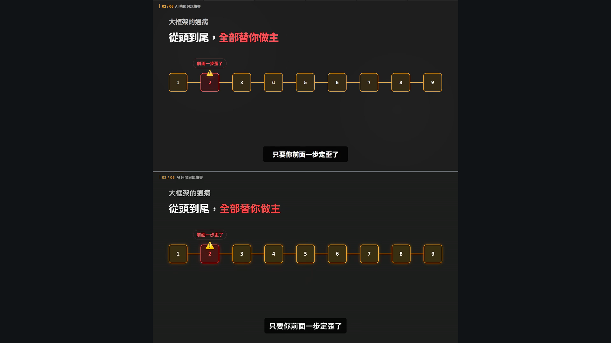

# Remotion implementation

Implement the evidence graph, not a generic motion-design preset. Read `story-to-geometry.md`, `visual-grammar.md`, and `motion-grammar.md` first.

## Composition architecture

```text
ExplainerComposition
├─ SurfaceCanvas
├─ VideoChrome phaseIndex/phaseLabel
├─ SceneStage scene spec + state timeline
└─ CaptionTrack source cues
```

This architecture expresses target-specific R11. The target's visual phase index is not always identical to the published YouTube chapter list, so store it independently.

## Deterministic animation rules

- Use `useCurrentFrame()` and `useVideoConfig()` for every authored change.
- Convert seconds to frames with the composition `fps`; do not assume 60 fps in reusable data.
- Use `<Sequence>` or `<Series>` for scene timing and premount sequences that contain images or fonts.
- Use `interpolate()` or `interpolateColors()` for controlled state changes.
- Use `spring()` only when the cited sequence supports a settling entrance, such as E004.
- Do not use CSS animations or transitions; they are not deterministic in Remotion rendering.
- Put connectors in an SVG layer behind cards; animate path visibility with dash offset or opacity when supported by E009.
- Use `` for local assets and load/await fonts before render.
- Keep captions in a separate track so cue length never changes diagram layout.

R17 and R18 require a comment beside any segment-local calibration or approximation.

```ts
// R06 / E002 — V00 01:55.10–01:57.40.
// Positions are measured for this scene; activation order is directly observed.
const activationAt = [/* scene-relative frames */];
```

## Scene data model

Prefer state timelines over scattered JSX frame literals:

```ts
type VisualState = 'inactive' | 'active' | 'error' | 'success' | 'dimmed';

type TimedState = {
  at: number;
  state: VisualState;
};

type EvidenceRef = {
  ruleIds: string[];
  evidenceIds: string[];
  referenceImage: string;
  certainty: 'recurring' | 'target-specific' | 'inference';
};

type SceneSpec = EvidenceRef & {
  id: string;
  from: number;
  durationInFrames: number;
  layoutFamily: 'left' | 'center' | 'compare' | 'pipeline';
};
```

Every `SceneSpec` must carry its provenance into review output.

## Component map

| Component | Observed behavior | Evidence |
|---|---|---|
| `VideoChrome` | fixed six-segment rail and phase label | R05, R11; E015, E020, E022 |
| `CaptionTrack` | independent black bottom capsule | R02, R11; E015, E031, E038 |
| `HeadlineBlock` | inline semantic color and optional underline | R04, R10; E001 |
| `StepPipeline` | full scaffold then ordered activation/error state | R06, R07; E002, E003 |
| `ModuleGrid` | scattered tiles settle to a grid | R08; E004 |
| `CompareColumns` | first side, second side, then result | R09; E005, E006 |
| `Panel` / `WindowPanel` | product, terminal, browser, report evidence | R12; E006, E011, E026, E031 |
| `NodeGraph` | nodes first, connectors behind | R03; E009 |
| `MappingRows` | append without rearranging prior rows | R16; E012, E019 |
| `VerdictOverlay` | dim completed scene, then callout | R09, R16; E013 |
| `IllustrationHero` | whole SceneStage replacement at metaphor beat | R13; E008, E017, E029 |

The bundled files under `assets/remotion-primitives/` implement the verified 01:49–02:16 reconstruction. Their exact dimensions, activation frames, and spring settings are not global source evidence.



## Still-first review

Render entry, midpoint, and final-hold stills for each scene. Compare each still against its cited image for:

- safe margins and alignment;
- text hierarchy and overflow;
- number and grouping of primitives;
- color role rather than only hex similarity;
- whether the state change is legible without narration;
- whether fixed chrome and captions stayed independent.

Before delivery, run `python scripts/validate_evidence.py`, render the complete composition, decode it once with FFmpeg, and include the evidence IDs in the storyboard and comparison sheet.
