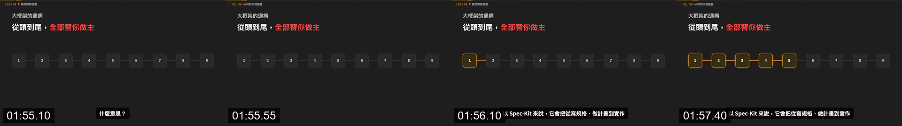
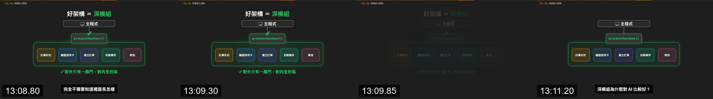
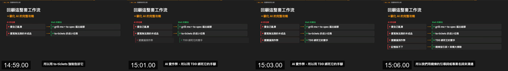

# Story to geometry

Read `evidence-index.json` beside this file before using the mappings. Rule IDs identify the claim; evidence IDs identify a source video, timecode, and bundled image.

## Choose the semantic job first

Assign each narration beat one primary job. If a sentence appears to need two unrelated geometries, split it into two scenes. The recurring channel rule is to convert an abstract claim into explicit spatial relationships before adding decoration (R03: E002, E021, E025, E035, E041).

| Narration job | Observed geometry | Build order | Provenance |
|---|---|---|---|
| Identify a term | One wordmark, underline, chip, or single card | term → underline or supporting badge | R03; E001 |
| Identify a person/source | Portrait plus name and handle in one identity card | replace the previous group as one unit | R03; E016 |
| Add numeric proof | Metric card beside or below the claim | claim first → metric second | E015 and target-full opening analysis |
| Show ordered steps | Complete horizontal node scaffold with connectors | inactive scaffold → activate left-to-right | R06; E002 |
| Show downstream failure | Reuse the process geometry and mutate state | fault → connector → subsequent nodes turn red | R07, R10; E003 |
| Show modularity | Repeated equal-weight tiles in a grid | scattered poses → aligned grid → labels | R08; E004 |
| Divide responsibility | Two columns or panels with a relation between them | headline → first side → second side → result | R09; E005, E006 |
| Show containment/locality | Parent container encloses children and exposes a controlled boundary | children → parent boundary → success emphasis | R07, R10; E010 |
| Show complex dependencies | Root and child cards connected by curves behind the cards | nodes first → connectors draw behind | R03; E009 |
| Demonstrate an implementation | Product/browser/terminal panel contained inside the explainer canvas | concept → actual UI → result | R12; E006, E011, E026, E031, E033 |
| Map problem to solution | Repeated rows, each with left item, arrow, right item | append rows in narration order | R16; E012, E019 |
| State a verdict | Existing comparison remains visible but is dimmed under a callout | complete comparison → dim → verdict overlay | R09, R16; E013 |
| Reset abstraction | One centered illustration or abstract hero | replace the entire SceneStage, retain chrome | R13; E008, E017, E029, E034 |







## Preserve geometry when the model has not changed

If narration says that the same system becomes active, fails, passes, or is constrained, keep node positions and relationships stable and mutate visual state (R07). A cut or complete layout replacement is warranted when the conceptual model changes—for example, from a pipeline to modular tiles, or from an abstract dependency idea to a house metaphor.

Do not move objects simply to create activity. In E002 and E003, movement is secondary; readability comes from seeing the same scaffold acquire a new state.

## Use one dominant relation per scene

- Sequence: one baseline and one reading direction.
- Comparison: two clear sides and one relation or verdict.
- Hierarchy: one parent/child direction.
- Containment: one visible boundary and a deliberate entry point.
- Network: connectors behind nodes; reduce labels until crossings remain readable.
- Enumeration: repeated cards or rows with stable alignment.

The target sometimes contains a real UI panel beside a geometric explanation, but R12 classifies this as demonstration evidence rather than the default for every beat.

## Storyboard schema

For every row, record all fields below. Reject a row that lacks both a rule ID and an evidence ID.

```text
scene_id
narration_start / narration_end
semantic_job
diagram_family
neutral_start_frame
narration_triggered_changes[]
final_hold
exit
rule_ids[]
evidence_ids[]
reference_image
certainty: recurring | target-specific | inference
adaptation_notes
```

When none of the observed families fits the meaning, say so. Ask for a new reference or label the choice as a new visual direction; do not claim it belongs to this source system.
