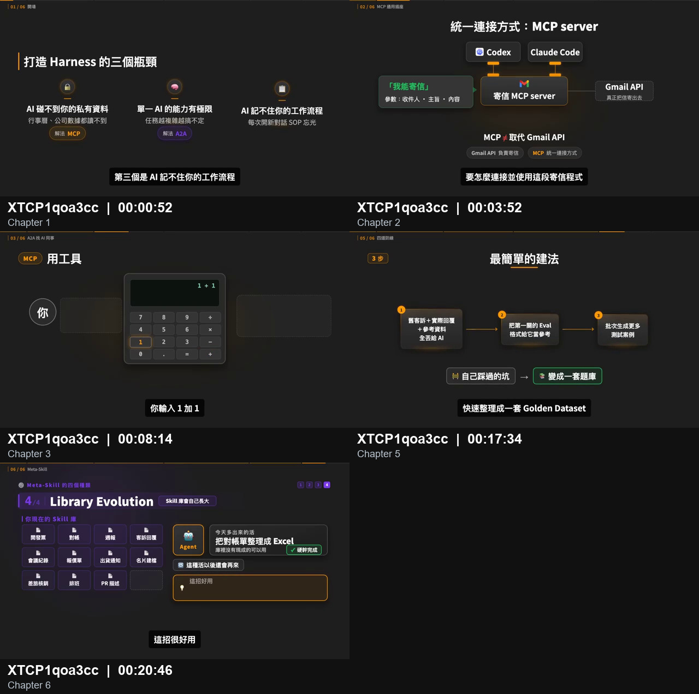
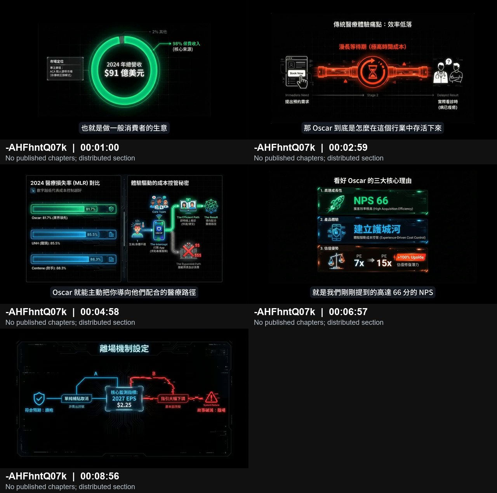

# Visual grammar

This reference separates cross-video conventions from target-local measurements. Use the evidence index to inspect every cited frame.

## Current-series baseline

Use the current AI-explainer baseline when the user asks for a match to V00:

- dark, information-first canvas (R01);
- bold white sans hierarchy and a separate bottom caption capsule (R02);
- flat dark-gray cards, thin borders, generous negative space, and orange structural accents (R04);
- segmented top progress rail and left chapter marker (R05);
- cards, nodes, arrows, comparison, or containment chosen by meaning (R03).




## Fixed layer hierarchy in V00

R11 is target-specific. The observed 16:9 hierarchy is:

```text
SurfaceCanvas
├─ VideoChrome: segmented progress rail + left phase label
├─ SceneStage: headline + diagram/panels/illustration + annotation
└─ CaptionTrack: bottom center, highest z-index
```

The target's common 720p measurements are observations, not universal channel tokens:

| Region | Approximate 720p measure | Confidence and source |
|---|---:|---|
| left narrative safe margin | 67 px | high; E002 |
| top progress rail | y=0, about 2–3 px high | high; E015 |
| left phase label | x≈28, y≈17 | high; target motion report |
| left kicker origin | x≈67, y≈69 | high; E002 |
| left hero title origin | x≈67, y≈133 | high; E002 |
| SceneStage | about x=67–1213, y=70–580 | high; target motion report |
| caption bottom | 40 px | exact only for the calibrated segment |

For 1920×1080 reproduction, the calibrated target segment uses a 1.5× conversion. R17 requires remeasurement for any other scene.

## Layout families

1. Left narrative: kicker, large headline, then diagram.
2. Centered hero: one title and one object/illustration at the visual center.
3. Two-column comparison: panels separated by a gap, badge, arrow, or `VS` relation.
4. Horizontal process: equal nodes along one baseline; connectors behind nodes.

Use one family as the dominant scaffold. Do not combine a dense grid, a network, a two-column comparison, and a full UI screenshot in the same shot unless a cited source frame does so.

## Color roles

The target-local measured values below come from compressed frames and the calibrated replica. The semantic roles are more reliable than exact hex values (R10, R17).

| Token | Approximate value | Observed role |
|---|---|---|
| `surface.canvas` | `#1e1e1e` | fixed background |
| `surface.panel` | `#292929` | cards/windows |
| `border.subtle` | `#3a3a3a` | inactive borders/connectors |
| `text.primary` | `#f5f5f5` | titles, labels, captions |
| `text.muted` | `#b8b8b8` | kicker and secondary explanation |
| `accent.primary` | `#f6a21a` | current focus, navigation, path, underline |
| `semantic.danger` | `#ff5158` | error, drift, coupling, harmful outcome |
| `semantic.success` | `#2dcc71` | pass, completion, locality, containment |
| `series.purple` | `#7845e7` | nominal category, not success/failure |

Blue, teal, and magenta also appear as nominal category colors. Their exact compressed-frame hex values are not source-project tokens.


## Typography and subtitles

- Claims and Chinese headlines: heavy sans, often with one phrase recolored.
- Skill names, filenames, code, terminal text, and node identifiers: monospace.
- Bottom captions: white bold sans, single line in the observed target frames, black rounded capsule, independent of diagram layout (R02, R11).
- The calibrated implementation uses Noto Sans TC and Cascadia Code because they visually match; the original font files remain unobservable (R18).

Measure text before assigning a fixed card width. Do not reduce a core claim to unreadably small type merely to preserve a copied box dimension.

## Density and assets

The current series uses more negative space than the early finance sample. One diagram should answer one semantic question. Real UI is occasional (R12); illustration is an occasional metaphor/reset (R13). If a presenter PiP is requested, older samples keep it small and subordinate (R14).

## Explicit exclusions

R15 separates the current AI baseline from the early finance era. Do not mix the early neon HUD, glowing grid, several competing saturated colors, valuation multiples, or red/green performance cards into a V00-style technical explainer unless the user explicitly asks for that era/topic.



The exclusion is a sample-backed production boundary, not a claim that the creator can never reuse an older motif.
