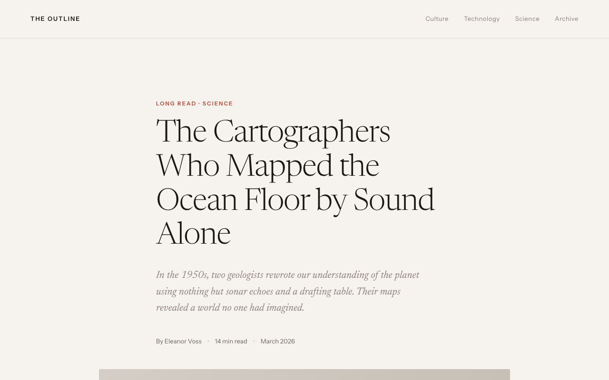
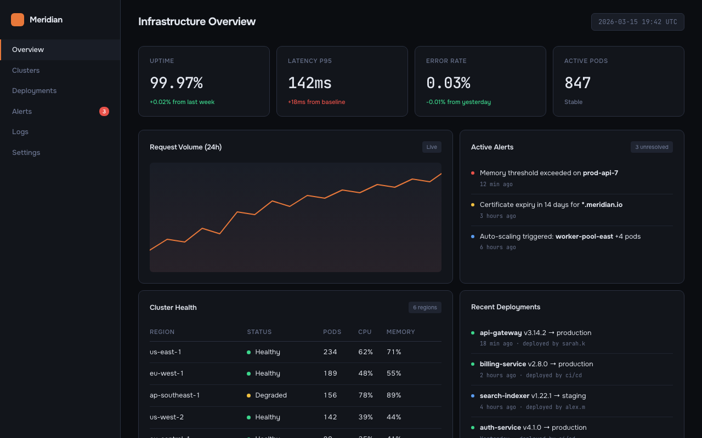
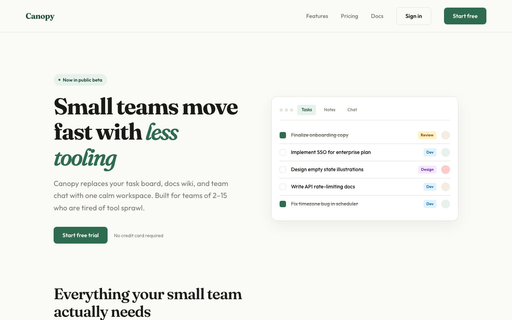

# variant-design（中文版）

**[English](./README.md)** | 中文

> 解决空白画布问题。提示词 → 3 个完整的差异化设计 → 迭代 → 导出。

一个受 [Variant](https://variant.com) 设计社区启发的 Claude Code 技能，内置 **Impeccable 设计系统**。输入一个提示词，获得三个截然不同的设计方向——每个来自不同工作室的审美——然后用一个词迭代。

---

## 示例输出

同一个提示词生成三个变体——每个都像来自不同工作室：

| A — 编辑/杂志 | B — 暗色仪表盘 | C — SaaS 落地页 |
|---|---|---|
|  |  |  |

---

## 功能概览

### 生成模式（默认）

1. **场景检测** — 仪表盘、SaaS 落地页、编辑/杂志、电商、移动应用、创意工具、教育、作品集、餐饮美食、时尚生活
2. **加载设计系统参考** — 排版、色彩理论（OKLCH）、空间设计、动效、微交互、交互、响应式、UX 文案
3. **生成 3 个差异化变体** — 每个采用不同的审美方向，包含完整交互（滚动揭示、动态图表、悬浮效果、功能性 JS）
4. **AI 审美质量门** — 自动检测并过滤常见的 AI 生成审美特征
5. **输出可交互代码** — 默认交互式 HTML，或 React + Framer Motion。真实内容，没有占位文本
6. **提供迭代操作** — 推到极致、精修、批评、换风格、重混色彩、重排布局、添加动效、戏剧化、使其可交互

### 分析模式（已有网站）

1. **扫描现有代码** — 读取 HTML、CSS、JSX、Vue、Svelte 文件中的设计 token
2. **提取设计原语** — 颜色、字体、间距、组件、过渡、断点
3. **检测不一致性** — 近似重复颜色、偏离网格间距、缺失悬浮状态、对比度不足、字体比例问题
4. **生成风格报告** — 带评分的审计报告，含严重程度和优先修复清单
5. **生成 token 文件** — 将散落的硬编码值整合为 CSS 自定义属性
6. **生成风格匹配页面** — 新页面精确遵循你现有的设计系统
7. **生成迁移计划** — 分阶段整合不一致代码库的清单

```
audit                    → 完整风格一致性报告
tokens                   → 从现有 CSS 提取 token
match                    → 生成匹配现有风格的新页面
new page pricing         → 添加遵循当前设计的 /pricing 页面
migrate                  → 分阶段 token 整合计划
compare old new          → 现有页面 vs 重新设计的并排对比
```

---

## 安装

### Claude Code（推荐）

```bash
claude skill install https://github.com/YuqingNicole/variant-design-skill
```

或手动添加到项目的 `SKILL.md` 中——复制 [`SKILL.md`](./SKILL.md) 的内容。

### 其他 Claude 界面

**Claude.ai（网页/桌面）：** 将 `SKILL.md` 内容粘贴到 Project 的自定义指令中，或在对话开头作为系统提示词。

**API / 自定义集成：** 将 `SKILL.md` 作为系统消息放在用户消息之前。

---

## 使用方法

### 基础触发

最简单的方式——描述你想要什么：

```
设计一个加密货币交易终端的仪表盘
给我一个 SaaS 落地页的 3 个方向
给我一个健康应用的 UI 选项
```

### 定向触发——锁定风格或参考某个网站

你可以更具体地指定审美方向、色板或想要匹配的现有网站：

```
开发者工具首页，代码优先的 hero 区域带 CLI 片段，暗色 Data/Technical 方向

AI agent 工具的落地页 — Dark Indigo 色板，Geist 字体，saas.md 中的 Code-First 布局

外卖应用的 3 个变体 — 一个 Warm/Human，一个 Bold/Expressive，一个 Neo-brutalist

重现 [你描述的网站] 的视觉风格 — 深海军蓝，等宽字体，泳道图
```

**提示：** 你给出的约束越多（方向 + 色板 + 布局模式），输出越精准。提示词越开放，三个变体的差异越大。

### 定向提示词结构

```
[是什么] + [领域] + [审美方向或色板] + [布局提示] + [签名细节]
```

示例：

| 目标 | 提示词 |
|---|---|
| 匹配某网站的感觉 | `"开发者工具落地页 — 暗色 Data/Technical，CLI 代码 hero，Dark Indigo 色板"` |
| 自由探索 | `"冥想应用的落地页"` |
| 一个固定 + 两个自由 | `"金融仪表盘的 3 个方向 — 其中一个必须是 Amber Finance 暗色终端"` |
| 多屏流程 | `"冥想应用的 3 屏引导流程，Wellness Soft 色板"` |

### 迭代操作

看到初始 3 个变体后，用以下操作迭代：

| 操作 | 效果 |
|---|---|
| **Vary strong**（推到极致） | 将当前方向推到最大化 |
| **Vary subtle**（精细调整） | 精修打磨，保持同一审美 |
| **Distill**（蒸馏精简） | 去除一切非必要元素，露出设计本质 |
| **Change style**（换风格） | 保持布局，替换整体视觉语言 |
| **Remix colors**（重混色彩） | 用 OKLCH 生成 3 个替代色板：类似 / 互补 / 意想不到 |
| **Shuffle layout**（重排布局） | 相同内容和风格，不同构图 |
| **Add motion**（添加动效） | 在现有设计上叠加微交互和动画 |
| **Dramatize**（戏剧化） | 将交互推到电影级（视差、3D 倾斜、幕布揭开） |
| **Make interactive**（使其可交互） | 添加功能性交互：过滤、图表、拖拽、表单验证 |
| **Polish**（精修） | 对照设计系统精修：排版、间距、交互、动效、文案 |
| **Critique**（批评） | 对照全部 8 个设计系统维度的系统审计 |
| **Extract tokens**（提取 Token） | 导出设计令牌为 CSS / JSON / Tailwind 配置 |
| **See other views**（其他视图） | 移动端 / 暗色模式 / 空状态 / 引导流程 / 悬停状态 |
| **Mix**（合并变体） | 合并两个变体："Mix A + B" 或 "A 的布局 + C 的颜色" |

### 快速迭代简写

在 Claude Code 中可以用简写快速迭代：

```
A vary strong          → 将变体 A 推到极致
B remix colors         → 为变体 B 生成 3 个新色板
C → mobile             → 显示变体 C 的移动端视图
pick A                 → 选择 A 为最终方案
A + B colors           → A 的布局 + B 的色板
tokens A               → 提取 A 的 CSS 设计令牌
compare                → 三个变体并排对比
open B                 → 重新在浏览器打开 B
```

### 你会看到什么

文件会写入 `variant-output/` 目录并**自动在浏览器中打开** — 你永远不需要手动寻找或打开文件。终端中会显示紧凑的**摘要卡片**（方向、色板、字体、交互）。操作按 **Reshape / Tune / Animate / Refine / Export** 五组分类。

迭代时，同一文件会被覆盖并重新打开 — 浏览器标签页自动刷新。终端只显示 2-3 行变更摘要，不会输出完整代码。

---

## 参考库

### 领域参考
场景专用素材（启动提示词、色板、排版、布局、真实社区案例）：

| 文件 | 领域 |
|---|---|
| `references/dashboard.md` | 数据仪表盘、分析、监控、交易终端 |
| `references/editorial.md` | 杂志、新闻、长篇、报道 |
| `references/saas.md` | SaaS 落地页、B2B、开发者工具 |
| `references/ecommerce.md` | 电商、消费类应用、金融科技卡片 |
| `references/education.md` | 学习应用、测验、语言工具 |
| `references/creative.md` | 生成艺术、音乐工具、创意软件 |
| `references/mobile.md` | iOS/Android 应用、引导流程、主屏 |
| `references/portfolio.md` | 设计师作品集、开发者展示、自由职业者、工作室 |
| `references/food-beverage.md` | 餐厅、食谱、咖啡品牌、烘焙、鸡尾酒吧 |
| `references/fashion.md` | 时尚品牌、潮牌、美妆、室内设计、生活方式 |
| `references/palettes.md` | 通用色板库 — 39 个色板 × 7+ 审美方向（含 Pinterest 流行色板） |

### 设计系统参考（Impeccable）
每次生成都会加载的基础设计原则：

| 文件 | 涵盖内容 |
|---|---|
| `references/design-system/typography.md` | 模块化字阶、流体排版、字体配对、OpenType 特性、垂直韵律 |
| `references/design-system/color-and-contrast.md` | OKLCH 色彩空间、染色中性灰、60-30-10 法则、暗色模式、WCAG 对比度 |
| `references/design-system/spatial-design.md` | 4pt 网格、容器查询、眯眼测试、多维层级 |
| `references/design-system/motion-design.md` | 100/300/500 规则、ease-out-expo、错开动画、减弱动效、感知性能 |
| `references/design-system/interaction-design.md` | 8 种交互状态、focus-visible、表单、模态框、键盘导航 |
| `references/design-system/responsive-design.md` | 移动优先、内容驱动断点、输入方式检测、安全区域 |
| `references/design-system/ux-writing.md` | 按钮标签、错误消息公式、空状态、语气与语调、无障碍 |
| `references/design-system/micro-interactions.md` | 滚动揭示、悬浮效果、计数器、视差、页面过渡、Toast 通知 |
| `references/design-system/style-audit.md` | Token 提取、一致性检测、审计报告、迁移计划 |

---

## 设计原则

- **真实内容为王。** 可信的标题、真实的数据、实际的文案。让设计有生命力。
- **全力以赴。** 半吊子的审美比简单的更糟糕。
- **永不趋同。** 如果 A 是暗色，B 就不能也是暗色。每个变体必须像来自不同工作室。
- **排版优先。** 独特的展示字体 + 可靠的正文字体。禁用 Inter、Roboto、Arial、system-ui。
- **色彩 = 一个大胆的 OKLCH 选择。** 一个果断使用的主色胜过五个犹豫不决的颜色。始终给中性灰染色。
- **拒绝 AI 审美。** 不要紫色渐变、不要毛玻璃效果、不要弹跳缓动、不要居中一切的布局。

---

## 贡献

欢迎 PR。每个领域参考文件遵循统一的 6 部分结构：

1. 启动提示词（按领域分组）
2. 色板（CSS 自定义属性）
3. 排版配对
4. 布局模式
5. 签名细节
6. 真实社区案例

设计系统参考遵循 Impeccable 风格结构，包含原则、代码示例和反模式。

---

## 示例

`examples/` 目录包含可运行的演示：

| 文件 | 演示内容 |
|---|---|
| `examples/coffee-brand-interactive.html` | 完整交互式落地页：幕布揭开、分层入场、滚动揭示、数字递增、产品过滤、卡片悬浮抬升、图片放大、SVG 环形图、风味条形图、Toast 通知、移动端汉堡菜单、回到顶部、减弱动效适配 |

在浏览器中直接打开即可体验所有交互效果。

---

基于 [Claude Code Skills](https://claude.ai/code) 构建。设计系统由 [Impeccable](https://github.com/tychografie/impeccable) 驱动。
